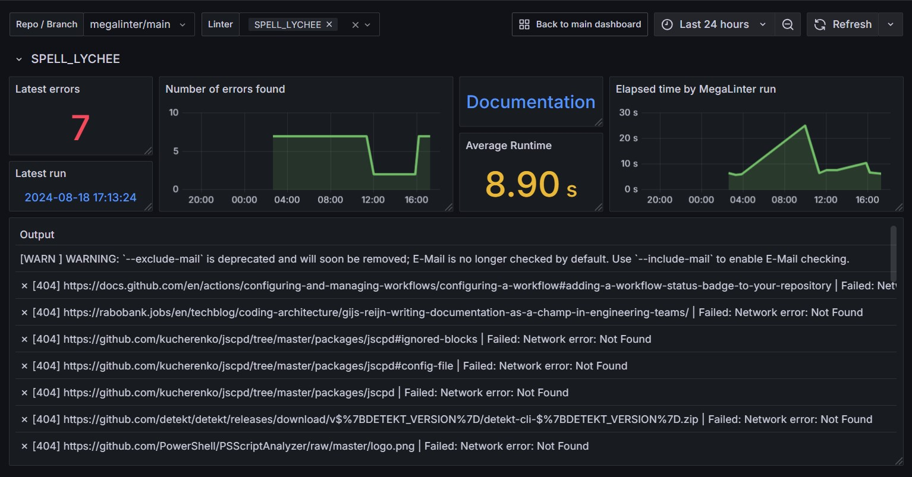
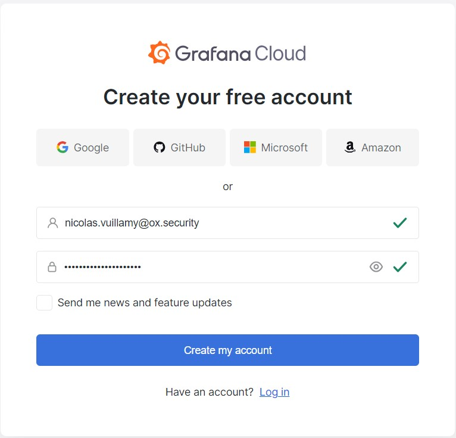
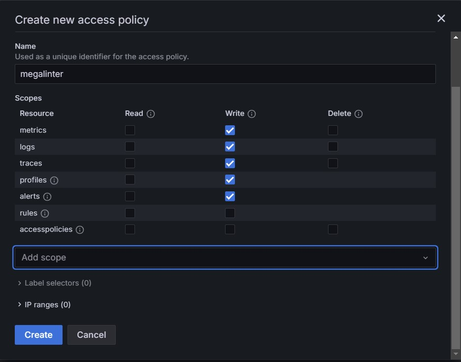

<!-- markdownlint-disable MD013 MD033 MD041 -->
# API Reporter (beta)

Send results as logs and metrics to observability tools, like Grafana.

## Usage

Use Grafana default MegaLinter dashboards, and build new ones to monitor everything you need from MegaLinter logs and metrics.




## Logs Configuration

Define the following CI/CD variables:

- **API_REPORTER_URL** : API endpoint
- **API_REPORTER_BASIC_AUTH_USERNAME** : Basic auth username _(if using Basic Auth)_
- **API_REPORTER_BASIC_AUTH_PASSWORD** : Basic auth password/token _(if using Basic Auth)_
- **API_REPORTER_BEARER_TOKEN** : Bearer token _(if using bearer auth)_

Examples of configuration:

```sh
API_REPORTER_URL=https://logs-prod-012.grafana.net/loki/api/v1/push
API_REPORTER_BASIC_AUTH_USERNAME=3435645645
API_REPORTER_BASIC_AUTH_PASSWORD=GHTRGDHDHdhghg23345DFG^sfg!ss
```

```sh
API_REPORTER_URL=https://my.custom.endpoint.net
API_REPORTER_BEARER_TOKEN=DDHGHfgfgjfhQESRDTHFKGKHFswgFHDHGDH
```

Example of logs sent to Loki:

```json
{
 "streams": [
  {
   "stream": {
    "source": "MegaLinter",
    "gitRepoName": "megalinter",
    "gitBranchName": "alpha",
    "gitIdentifier": "megalinter/alpha",
    "orgIdentifier": "alpha",
    "descriptor": "API",
    "linter": "spectral",
    "linterKey": "API_SPECTRAL"
   },
   "values": [
    [
     "1723831050362439098",
     "{\"linterDocUrl\": \"https://megalinter.io/latest/descriptors/api_spectral\", \"jobUrl\": \"\", \"severity\": \"success\", \"severityIcon\": \"\\u2705\", \"cliLintMode\": \"file\", \"numberFilesFound\": 1, \"numberErrorsFound\": 0, \"elapsedTime\": 1.54, \"output\": [\"text output from linter console logs\"]}"
    ]
   ]
  },
  {
   "stream": {
    "source": "MegaLinter",
    "gitRepoName": "megalinter",
    "gitBranchName": "alpha",
    "gitIdentifier": "megalinter/alpha",
    "orgIdentifier": "alpha",
    "descriptor": "BASH",
    "linter": "shellcheck",
    "linterKey": "BASH_SHELLCHECK"
   },
   "values": [
    [
     "1723831050362439098",
     "{\"linterDocUrl\": \"https://megalinter.io/latest/descriptors/bash_shellcheck\", \"jobUrl\": \"\", \"severity\": \"success\", \"severityIcon\": \"\\u2705\", \"cliLintMode\": \"list_of_files\", \"numberFilesFound\": 5, \"numberErrorsFound\": 0, \"elapsedTime\": 0.14, \"output\": [\"text output from linter console logs\"]}"
    ]
   ]
  },
  {
   "stream": {
    "source": "MegaLinter",
    "gitRepoName": "megalinter",
    "gitBranchName": "alpha",
    "gitIdentifier": "megalinter/alpha",
    "orgIdentifier": "alpha",
    "descriptor": "MARKDOWN",
    "linter": "markdownlint",
    "linterKey": "MARKDOWN_MARKDOWNLINT"
   },
   "values": [
    [
     "1723831050362439098",
     "{\"linterDocUrl\": \"https://megalinter.io/alpha/descriptors/markdown_markdownlint\", \"jobUrl\": \"\", \"severity\": \"warning\", \"severityIcon\": \"\\u26a0\\ufe0f\", \"cliLintMode\": \"list_of_files\", \"numberFilesFound\": 264, \"numberErrorsFound\": 291, \"numberErrorsFixed\": 0, \"elapsedTime\": 30.55, \"output\": [\"text output from linter console logs\"]}"
    ]
   ]
  }
}
```

## Metrics Configuration

Additionally, you can send metrics in Prometheus format to a secondary API endpoint.

The configuration is the same than for logs, but with different variable names.

- **API_REPORTER_METRICS_URL**
- **API_REPORTER_METRICS_BASIC_AUTH_USERNAME**
- **API_REPORTER_METRICS_BASIC_AUTH_PASSWORD**
- **API_REPORTER_METRICS_BEARER_TOKEN**

Example of configuration:

```sh
API_REPORTER_METRICS_URL=https://influx-prod-72-prod-eu-west-2.grafana.net/api/v1/push/influx/write
API_REPORTER_METRICS_BASIC_AUTH_USERNAME=345673
API_REPORTER_METRICS_BASIC_AUTH_PASSWORD=GHTRGDHDHdhghg23345DFG^sfg!ss
```

Example of metrics sent to Prometheus

```text
spectral,source=MegaLinter,orgIdentifier=alpha,gitIdentifier=megalinter/alpha,descriptor=API,linter=spectral,linterKey=API_SPECTRAL metric=0,numberFilesFound=1,elapsedTime=1.57
shellcheck,source=MegaLinter,orgIdentifier=alpha,gitIdentifier=megalinter/alpha,descriptor=BASH,linter=shellcheck,linterKey=BASH_SHELLCHECK metric=0,numberFilesFound=5,elapsedTime=0.13
markdownlint,source=MegaLinter,orgIdentifier=alpha,gitIdentifier=megalinter/alpha,descriptor=MARKDOWN,linter=markdownlint,linterKey=MARKDOWN_MARKDOWNLINT metric=291,numberFilesFound=264,numberErrorsFixed=0,elapsedTime=31.5
```

## Troubleshooting

If you want to see the content of the API notifications in execution logs, you can define `API_REPORTER_DEBUG=true`

## All Configuration variables

The following variables must be sent to the docker run command

| Variable                                 | Description                                              | Default value |
|------------------------------------------|----------------------------------------------------------|---------------|
| API_REPORTER                             | Activates/deactivates API reporter                       | `false`       |
| API_REPORTER_URL                         | Logs endpoint URL                                        | <!-- -->      |
| API_REPORTER_BASIC_AUTH_USERNAME         | Logs endpoint auth username                              | <!-- -->      |
| API_REPORTER_BASIC_AUTH_PASSWORD         | Logs endpoint auth password                              | <!-- -->      |
| API_REPORTER_BEARER_TOKEN                | Logs endpoint auth token                                 | <!-- -->      |
| API_REPORTER_METRICS_URL                 | Metrics endpoint URL                                     | <!-- -->      |
| API_REPORTER_METRICS_BASIC_AUTH_USERNAME | Metrics endpoint auth username                           | <!-- -->      |
| API_REPORTER_METRICS_BASIC_AUTH_PASSWORD | Metrics endpoint auth password                           | <!-- -->      |
| API_REPORTER_METRICS_BEARER_TOKEN        | Logs endpoint auth token                                 | <!-- -->      |
| API_REPORTER_DEBUG                       | Activate to see notif content in MegaLinter console logs | `false`       |


## Grafana Setup

If you don't have a Grafana server, you can use Grafana Cloud Free Tier (14 days of logs & metrics retention + 3 users, no credit card required, free forever)

### Create Grafana Account

Create a Grafana Cloud Free account at [this url](https://grafana.com/auth/sign-up/create-user?pg=hp&plcmt=cloud-promo&cta=create-free-account){target=blank}



___

Input a Grafana Cloud org name (megalinter in the example)


___

Next screen, you can skip setup


### Gather URLs & auth info

Create a notepad when you copy paste the following text

```sh
API_REPORTER_URL=
API_REPORTER_BASIC_AUTH_USERNAME=
API_REPORTER_BASIC_AUTH_PASSWORD=
API_REPORTER_METRICS_URL=
API_REPORTER_METRICS_BASIC_AUTH_USERNAME=
API_REPORTER_METRICS_BASIC_AUTH_PASSWORD=
```

### Get Loki configuration

Go to **Connections** -> **Data Sources** and click on **grafanacloud-YOURORGNAME-logs (Loki)**


___

Build Logs push url

- Copy value of Connection URL (something like `https://logs-prod-012.grafana.net/`)
- Add `/loki/api/v1/push` at the end
- Copy value to variables `API_REPORTER_URL`

Example: `API_REPORTER_URL=https://logs-prod-012.grafana.net/loki/api/v1/push`

Copy value of Authentication -> User and paste it with variable `API_REPORTER_BASIC_AUTH_USERNAME`

Example: `API_REPORTER_BASIC_AUTH_USERNAME=898189`

Leave NOTIF_API_BASIC_AUTH_PASSWORD empty for now, you can't get it here


_See [Grafana documentation](https://grafana.com/blog/2024/03/21/how-to-use-http-apis-to-send-metrics-and-logs-to-grafana-cloud/#sending-logs-using-the-http-api) for more info_

### Get Prometheus configuration

Go to **Connections** -> **Data Sources** and click on **grafanacloud-YOURORGNAME-prom (Prometheus)**


___

Build Metrics push url

- Copy value of Connection URL (something like `https://prometheus-prod-24-prod-eu-west-2.grafana.net/api/prom`)
- Replace `prometheus` by `influx`
- Replace `api/prom` by `api/v1/push/influx/write`
- Then copy value to variables `API_REPORTER_METRICS_URL`

Example: `API_REPORTER_METRICS_URL=https://influx-prod-24-prod-eu-west-2.grafana.net/api/v1/push/influx/write`

Copy value of Authentication -> User and paste it with variable `API_REPORTER_METRICS_BASIC_AUTH_USERNAME`

Example: `API_REPORTER_METRICS_BASIC_AUTH_USERNAME=1596503`

Leave `API_REPORTER_METRICS_BASIC_AUTH_PASSWORD` empty for now, you can't get it here


_See [Grafana documentation](https://grafana.com/blog/2024/03/21/how-to-use-http-apis-to-send-metrics-and-logs-to-grafana-cloud/#sending-metrics-using-the-http-api) for more info_

### Create Service Account

Go to **Administration** -> **Users and Access** -> **Cloud Access Policies**, then click on **Create Access Policy**


___

Create the access policy

- Define **MegaLinter** as name and display name
- Select **write** for items **metrics, logs, traces, profiles, alerts** (only metrics and logs are used today, but who knows hat new features we'll release in the future !)
- Click on **Create**



___

On the new Access Policy `MegaLinter`, click on **Add Token** at the bottom right


___

Name it megalinter-token, let `No expiration` then click **Create**


___

On the next screen, click on **Copy to clipboard** then paste in your notepad in front of variables **API_REPORTER_BASIC_AUTH_PASSWORD** and **API_REPORTER_METRICS_BASIC_AUTH_PASSWORD**


Example:

```
API_REPORTER_BASIC_AUTH_PASSWORD=glc_eyJvIjoiMTEzMjI4OCIsIm4iOiJzZmR4arZW4iLCJrIjoiN0x6Mz1IM041IiwibSI6eyJyXN0LTIifX0=
API_REPORTER_METRICS_BASIC_AUTH_PASSWORD=glc_eyJvIjoiMTEzMjI4OCIsIm4iOiJzZmR4arZW4iLCJrIjoiN0x6Mz1IM041IiwibSI6eyJyXN0LTIifX0=
```

### Configure CI variables on repository

Now configure all of the 6 variables on the repository running MegaLinter.


There value must be accessible from MegaLinter Docker image, so you might need to redeclare them in YML workflows depending on your git provider.

_Example with GitHub Workflow:_


### Download MegaLinter dashboards

TODO FROM HERE


### Create Dashboard folder

Go in menu **Dashboards** then click on **New** then **New folder**


___

Create folder `MegaLinter Dashboards`


### Import default sfdx-hardis Grafana Dashboards

For each downloaded Dashboard JSON file, process the following actions.

Click **New** then **Import**


___

Click on **Upload Dashboard JSON File** and select one of the Dashboards JSON files you downloaded on your computer.


___

- Let Name, Folder and UID default values
- Select your Loki or Prometheus source. They can be:
  - **grafanacloud-YOURORGNAME-logs (Loki)**
  - **grafanacloud-YOURORGNAME-prom (Prometheus)**


___

Click **Import**


__

Repeat the operation for all Dashboard JSON files, and you're all set !


